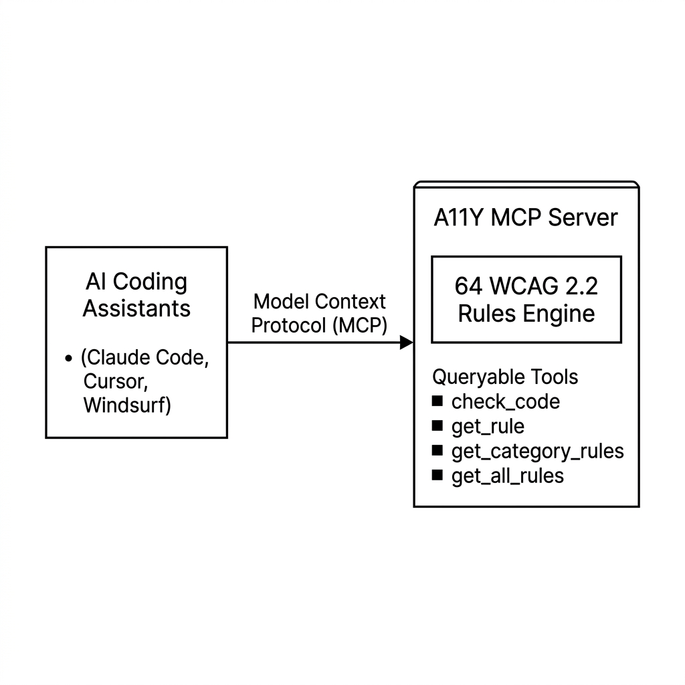

# A11Y — WCAG 2.2 Accessibility Toolkit

A two-part project: an **MCP server** that exposes 64 WCAG 2.2 accessibility rules to AI coding agents, and a **Frontend** landing page built with React + Vite.

---

## Architecture



---

## Structure

```
A11Y/
├── MCP-server/   # Model Context Protocol server (npm package)
└── Frontend/     # React + Vite landing page
```

---

## MCP Server

Publishes 64 WCAG 2.2 rules as queryable tools so AI agents (Claude Code, Cursor, Windsurf) can audit code for accessibility issues in real time.

**Install globally:**
```bash
npm install -g a11y-mcp-server
```

**Tools exposed:** `get_rule`, `get_category_rules`, `get_rules_by_level`, `check_code`, `get_all_rules`

See [`MCP-server/README.md`](./MCP-server/README.md) for full setup and integration instructions.

---

## Frontend

React 18 + TypeScript + Tailwind CSS landing page, built with Vite and pre-rendered for static hosting.

**Run locally:**
```bash
cd Frontend
npm install
npm run dev
```

---

## License

MIT
